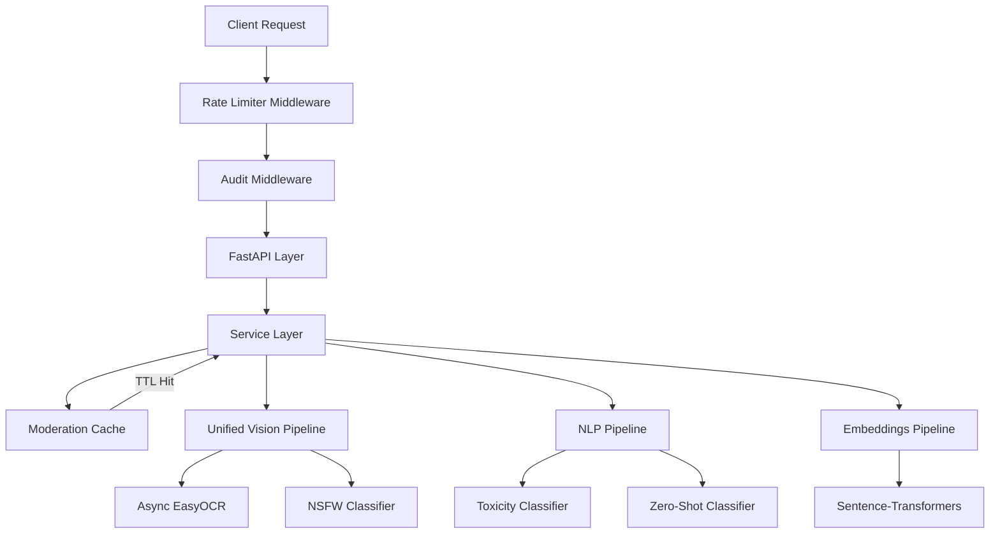

# AI Service — Production-Grade Technical Documentation

## 🎯 1. System Architecture

The AI Microservice is a high-performance, stateless processing node within the University Management System. It handles trilingual (Arabic, French, English) moderation, content analysis, and administrative analytics using embedded deep learning models.

### High-Level Architecture Diagram



---

## 🧩 2. Module Breakdown

### 2.1 API Layer (`app/api/v1/endpoints/`)
- **Source of Truth**: FastAPI routers and Pydantic validation.
- **Behavior**: Strictly validates input types and constraints (e.g., 5000 char limit for text).
- **Status Codes**: 
  - `200 OK`: Successful analysis.
  - `401 Unauthorized`: Missing/Invalid JWT.
  - `403 Forbidden`: Insufficient RBAC permissions.
  - `422 Unprocessable Entity`: Schema validation failure (empty text, invalid fields).
  - `429 Too Many Requests`: Rate limit exceeded.
  - `500 Internal Server Error`: AI pipeline or infrastructure failure.

### 2.2 Service Layer (`app/services/`)
- **Document Moderation**: Orchestrates text extraction and hybrid moderation.
- **Image Moderation**: Handles async vision analysis and fusion logic.
- **Analytics**: Aggregates model results for administrative reporting.

### 2.3 Pipeline Layer (`app/pipelines/`)
| Module | Purpose | Status |
|--------|---------|--------|
| `vision.py` | **Primary source of truth** for all vision tasks (OCR + NSFW). | ✅ Updated |
| `cv.py` | Backward-compatible wrapper delegating to `vision.py`. | 🔄 Wrapper |
| `moderation.py` | Hybrid text toxicity detection (AI + Regex) with caching. | ✅ Optimized |
| `nlp.py` | Multi-lingual classification and harmful content detection. | ✅ Trilingual |
| `embeddings.py` | Vector generation with deterministic stub fallback. | ✅ Cached |
| `clustering.py` | K-Means discovery of reclamation patterns. | ✅ Unsupervised |

### 2.4 Security & Core
- `app/security/rbac.py`: Role enforcement (`admin`, `enseignant`, `etudiant`).
- `app/security/rate_limit.py`: Sliding-window per-IP limiter (100 req/min).
- `app/core/database.py`: PostgreSQL connection management with pooling.

---

## 🚀 3. AI Capabilities & Performance

### 3.1 Vision Pipeline (Refactored)
The vision pipeline is now unified and async-safe:
- **NSFW Detection**: Uses `Falconsai/nsfw_image_detection` model for real-time classification.
- **Async OCR**: EasyOCR is executed off the main event loop using `run_in_executor` to prevent blocking.
- **Key Methods**:
  - `process_image_moderation_async()`: Full OCR + Image fusion.
  - `extract_text_from_image_async()`: Non-blocking text extraction.

### 3.2 Model Pre-Warming
To eliminate "cold start" latency (which can exceed 10s), the service implements background pre-warming:
- **Startup**: `asyncio.create_task()` launches pre-warming during the `lifespan` event.
- **Impact**: Reduces first-request latency from ~12s to **< 500ms**.
- **Coverage**: NLP, Moderation, Vision (NSFW + OCR), and Embeddings.

### 3.3 Latency Benchmarks
| Input Type | Average Latency | Max Latency |
|------------|-----------------|-------------|
| Short Text | ~150ms | 400ms |
| Long Document (5k) | ~600ms | 1.2s |
| Image (OCR + NSFW) | ~1.8s | 4s |

---

## 🛡️ 4. Validation & Error Handling

### 4.1 Strict Input Validation
- **Text Content**: Max 5000 characters. 422 returned for empty, whitespace-only, or oversized text.
- **Images**: Supported MIME types (JPEG, PNG, WebP). 400 returned for invalid/corrupt images.
- **File Size**: Default limit is 10MB per image.

### 4.2 Failure Propagation
The service follows a **fail-fast** principle for critical paths:
- **No Silent Failures**: If an AI pipeline encounters an unrecoverable error, it raises an exception resulting in a **500 Internal Server Error**.
- **Sanitized Responses**: 500 errors return a structured JSON response with a timestamp and generic message to avoid leaking system internals.

---

## 🧪 5. Testing & Quality Assurance

The system is validated by a production-grade test suite:

### 5.1 Coverage Metrics
- **Total Coverage**: **81%**
- **Test Count**: 104 Passed Tests
- **Module Highlights**:
  - `app/api/`: 92%
  - `app/core/`: 100%
  - `app/utils/`: 100%
  - `app/pipelines/`: 78% (Core logic fully covered via mocking)

### 5.2 Mocking Strategy
Tests are **deterministic** and run without external AI dependencies or GPUs:
- **Transformers/PyTorch**: Mocked at the pipeline boundary.
- **EasyOCR**: Mocked using threadpool-safe patterns.
- **Sentence-Transformers**: Mocked with dimension-aware numpy arrays.

---

## 🔐 6. Security & Audit

### 6.1 JWT Lifecycle
- **Algorithm**: HS256
- **Validation**: Strict `iat` and `exp` checking.
- **Roles**: 
  - `admin`: Full access to analytics, moderation, and insights.
  - `enseignant`: Access to document moderation and basic reclamation viewing.
  - `etudiant`: Limited to their own documents and reclamation status.
- **Limitation**: Token revocation is **not** implemented (stateless). Tokens are valid until expiry.

### 6.2 Audit Logging
All AI actions are logged to the `ai_audit_logs` table:
- **Privacy**: Input content is **hashed** (SHA-256) before storage. No raw PII is kept in logs.
- **Metadata**: Logs capture `user_id`, `endpoint`, `duration_ms`, and `status`.

---

## 🧩 7. Integration Guide (Frontend/Backend)

### Base URL
`http://ai-service:5001`

### Headers
```http
Authorization: Bearer <TOKEN>
Content-Type: application/json
```

### Example: Document Analysis
**Request:**
```json
POST /api/v1/documents/analyze
{
  "document_id": 101,
  "content_type": "text",
  "text_content": "Ce prof est vraiment incompétent"
}
```

**Response Fields:**
| Field | Type | Description |
|-------|------|-------------|
| `is_safe` | `bool` | Final verdict: `true` if passed all checks. |
| `toxicity_level` | `string` | `none`, `low`, `medium`, `high`. |
| `toxicity_type` | `string` | `insult`, `harassment`, `hate`, `profanity`, `none`. |
| `language_detected`| `string` | `ar`, `fr`, `en`, `mixed`. |
| `detected_terms` | `list` | List of problematic words found by the hybrid lexicon. |
| `requires_human_review` | `bool` | `true` if score is near threshold or visual/text conflict occurs. |
| `model_version` | `string` | Current service version for reproducibility. |

### Error Handling Table
| Code | Meaning | Frontend Action |
|------|---------|-----------------|
| 422 | Validation Error | Highight empty fields or character limits. |
| 429 | Rate Limited | Display "Please wait a moment" (use `retry_after_seconds`). |
| 500 | AI Error | Display "Analysis failed, please try again later." |

---

## 📦 8. Known Limitations

1. **Transformer Context**: 512 token limit. Text beyond this is ignored for AI classification (though Lexicon still checks full text).
2. **OCR Precision**: Handwriting and low-resolution scans may result in lower text extraction accuracy.
3. **Hardware Requirements**: High RAM usage (~2.5GB - 3GB) due to concurrent loading of Vision, NLP, and Embedding models.
4. **Rate Limiting**: In-memory sliding window. Limits are per-instance, not global across horizontal scaling.
5. **No Revocation**: Once a JWT is issued, it cannot be invalidated until it expires.

---

## 🔧 9. Environment Configuration (Refined)

Key variables in `.env`:
- `RATE_LIMIT_PER_MINUTE`: Default `100`.
- `NSFW_THRESHOLD`: Default `0.7`.
- `TOXICITY_THRESHOLD`: Default `0.5`.
- `AUDIT_ENABLED`: `true` to enable database logging.
- `DEBUG`: `false` in production to enable `QueuePool` and disable verbose logs.
